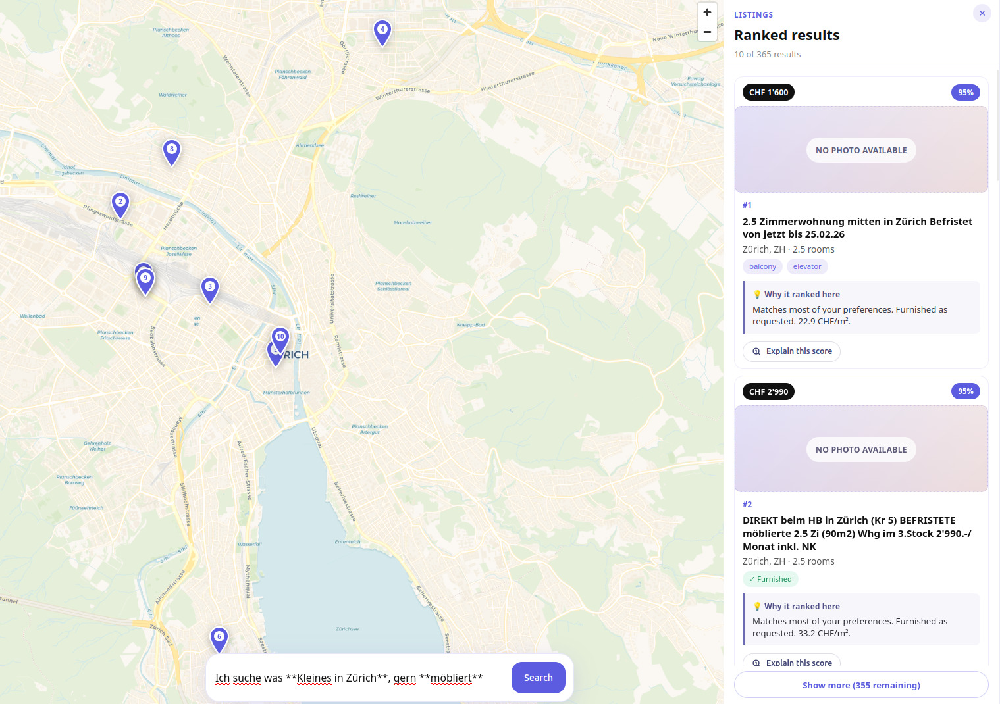
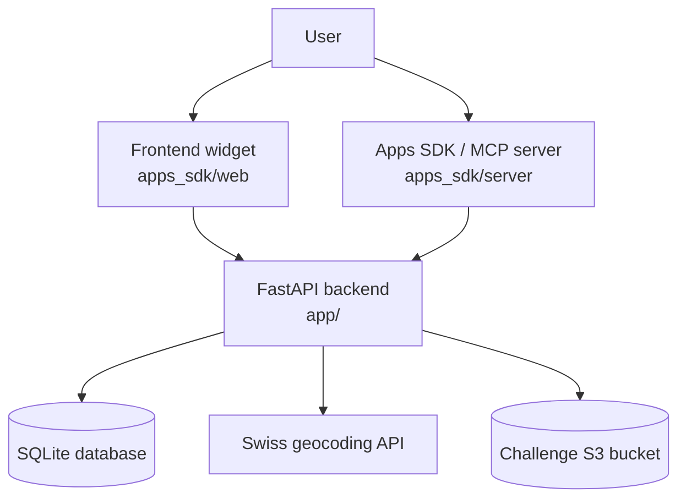
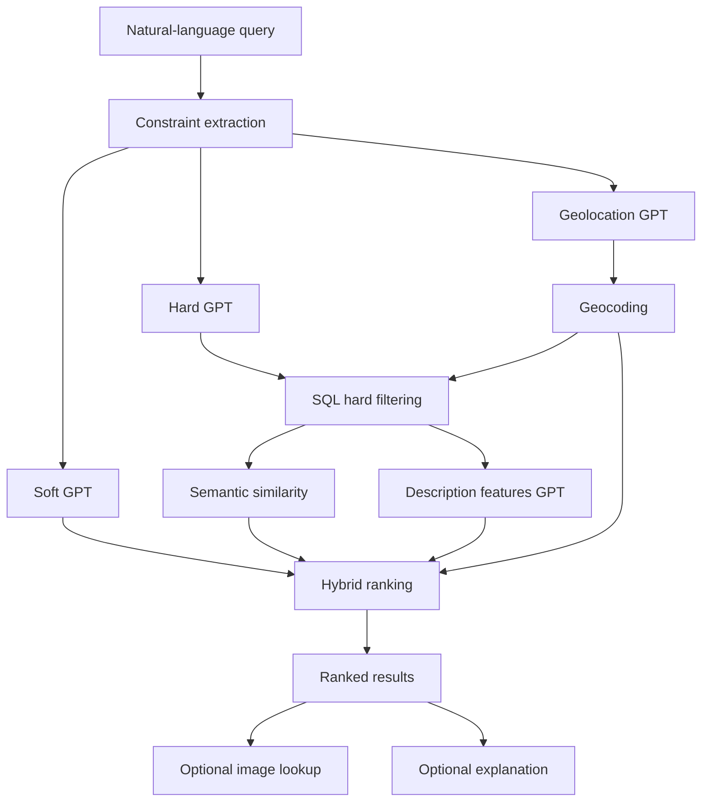

# Datathon Analytics Club



Real-estate listing search and ranking prototype built for the [Datathon 2026](https://www.datathon.ai/) hackathon by the Analytics Club at ETH Zurich.

This repository is our submission for the [RobinReal](https://robinreal.ai/) challenge track. The core objective was to turn a natural-language housing request into a ranked shortlist of relevant Swiss real-estate listings while respecting strict user constraints such as budget, location, rooms, availability, and required features.

## Table of Contents

- [1. Overview](#1-overview)
  - [1.1 Challenge Context](#11-challenge-context)
  - [1.2 What We Built](#12-what-we-built)
  - [1.3 Hackathon Scope](#13-hackathon-scope)
  - [1.4 AWS Side Challenge](#14-aws-side-challenge)
- [2. Architecture](#2-architecture)
  - [2.1 System View](#21-system-view)
  - [2.2 Request Pipeline](#22-request-pipeline)
  - [2.3 Exposed Endpoints](#23-exposed-endpoints)
- [3. Setup](#3-setup)
  - [3.1 Requirements](#31-requirements)
  - [3.2 Data Dependency](#32-data-dependency)
  - [3.3 Quick Start](#33-quick-start)
  - [3.4 Configuration](#34-configuration)
  - [3.5 Docker](#35-docker)
- [4. Development And Usage](#4-development-and-usage)
  - [4.1 API Usage](#41-api-usage)
  - [4.2 LLM Providers](#42-llm-providers)
  - [4.3 Embedding Artifacts](#43-embedding-artifacts)
  - [4.4 Apps SDK / MCP Integration](#44-apps-sdk--mcp-integration)
  - [4.5 Public Demo Helpers](#45-public-demo-helpers)
  - [4.6 Testing](#46-testing)
- [5. Reference](#5-reference)
  - [5.1 Project Structure](#51-project-structure)
  - [5.2 Security Notes](#52-security-notes)
  - [5.3 Relevant Files](#53-relevant-files)

## 1. Overview

### 1.1 Challenge Context

According to the official Datathon brief, the task is to solve a hybrid search problem:

- extract hard criteria that must be satisfied
- separate softer preferences that should influence ranking
- return valid listings sorted by overall relevance
- optionally expose explanations, map-ready coordinates, and a usable demo interface

The sponsor we chose was [RobinReal](https://robinreal.ai/), a Swiss PropTech company focused on digital rental workflows and AI-assisted property search and letting. That made the challenge a strong fit for a search system that can understand messy user language and convert it into actionable listing retrieval and ranking.

The original challenge description used for this project is also available in [challenge.md](challenge.md).

This project also started from the original template repository published for the challenge: [SwissBid/robinreal_datathon_challenge_2026](https://github.com/SwissBid/robinreal_datathon_challenge_2026).

### 1.2 What We Built

We built an end-to-end listing search application with four main layers:

- a `FastAPI` backend that exposes search, filtering, image-resolution, and explanation endpoints
- a query-understanding pipeline that separates hard constraints from soft preferences
- a hybrid ranking layer that combines structured filtering, semantic similarity, geospatial scoring, and description-derived features
- an optional `Apps SDK` / `MCP` integration with a React widget that renders ranked listings on a map

In practical terms, a user can type a request such as "bright apartment near ETH under 2800 CHF with balcony", and the system will:

1. parse the request into structured hard filters and softer ranking hints
2. query a local SQLite listing database for only the listings that satisfy the hard constraints
3. score the remaining candidates using semantic similarity, geo proximity, price and room fit, and extracted descriptive signals such as brightness, quietness, modernity, layout, family friendliness, and other lifestyle attributes
4. return a ranked list with a score, a short reason, listing metadata, and optional image and map support

### 1.3 Hackathon Scope

Our implementation focuses on the exact problem framing from the Datathon brief: `user query -> hard filters -> candidate listings -> relevance ranking`.

Concretely, we:

- built a natural-language search API for Swiss real-estate listings
- implemented a hard-filter extraction and retrieval stage so invalid listings are removed first
- designed a relevance ranking system that does not rely on one signal only, but blends semantic query matching, geography, and structured/listing-description features
- added explanation and image endpoints so search results are easier to interpret in a demo setting
- built a lightweight React map interface and an Apps SDK / MCP wrapper so the search experience can also be demonstrated as an interactive tool

### 1.4 AWS Side Challenge

The selected side challenge was the AWS track. In this repository, that work shows up in the infrastructure and model-provider choices:

- the LLM extraction and generation stages can run on either `openai` or `bedrock`
- Bedrock access is implemented in [app/participant/llm_client.py](app/participant/llm_client.py)
- listing images can be resolved from S3-backed paths via [app/core/s3.py](app/core/s3.py)
- the project ships with Docker and public-demo helpers so the prototype can be exposed as a public HTTPS demo

That means the project is not just a local ranking experiment: it is structured so the same search workflow can be demonstrated with cloud-backed model inference and asset delivery.

## 2. Architecture

The main backend flow is orchestrated in [app/harness/search_service.py](app/harness/search_service.py), while the optional Apps SDK integration lives in [apps_sdk/server/main.py](apps_sdk/server/main.py).

### 2.1 System View



This diagram is the high-level deployment view.

- the user can interact either through the React frontend in `apps_sdk/web` or through the Apps SDK / MCP integration in `apps_sdk/server`
- both clients call the same FastAPI backend in `app/`
- the backend uses the local SQLite database for listing retrieval and metadata
- the backend calls the Swiss geocoding endpoint `https://api3.geo.admin.ch/rest/services/ech/SearchServer` when a query contains named places that should be resolved into coordinates
- the backend accesses the challenge S3 bucket only for image resolution when the listing source requires cloud-hosted assets

The purpose of the system view is to show where each runtime component lives. It answers the question: "which services talk to which other services?"

### 2.2 Request Pipeline



This diagram is the ranking pipeline view.

- `Constraint extraction` is the entry point for query understanding
- `Hard GPT` extracts must-have filters such as city, price ceilings, room counts, availability, and mandatory features
- `Soft GPT` extracts preference signals that should influence ranking but should not discard listings by themselves
- `Geolocation GPT` detects named Swiss places such as `ETH`, `Zurich HB`, or specific landmarks, which are then resolved through the Swiss geocoding API
- `SQL hard filtering` removes invalid listings first, which keeps the rest of the pipeline focused on only feasible candidates
- `Semantic similarity` measures how close each surviving listing description is to the user query using precomputed embeddings and a query embedding
- `Description features GPT` extracts richer signals from the listing descriptions, such as brightness, modernity, quietness, family friendliness, transport quality, and other lifestyle attributes that are not always available as structured fields
- `Hybrid ranking` combines the hard-filter survivors, soft preferences, geo distance, semantic similarity, and extracted description features into the final order
- `Optional image lookup` runs afterwards and is not part of the core ranking logic
- `Optional explanation` produces a grounded natural-language explanation only when requested

The purpose of the request pipeline is to show how one search query is transformed into ranked results.

Request flow:

1. The user submits a natural-language housing query from the frontend or through the Apps SDK / MCP tool.
2. The backend runs three extraction stages in parallel: hard constraints, soft preferences, and geolocation intent.
3. Geolocation intent is optionally resolved through the geocoding API into coordinates and search radii.
4. Hard filters are applied first against the SQLite listing database.
5. The surviving candidates are enriched with semantic similarity and description-derived features.
6. The ranking layer combines query similarity, geo distance, and soft-preference matching into the final order.
7. Images are resolved afterwards when possible, including S3-backed lookups for challenge-hosted assets.

### 2.3 Exposed Endpoints

- `POST /listings/search/filter` for direct structured filtering
- `POST /listings/images` for image resolution
- `POST /listings/explain` for per-listing explanation generation
- `GET /health` for readiness checks

## 3. Setup

### 3.1 Requirements

- Python `3.12+`
- `uv` for dependency management and local commands
- Node.js if you want to build or run the widget directly
- Docker and Docker Compose if you want the containerized stack
- The challenge dataset restored into `raw_data/`

### 3.2 Data Dependency

This checkout does not currently contain `raw_data/`.

That matters because:

- the API bootstrap fails without CSV files in `raw_data/`
- most integration tests expect the dataset to be present
- the Docker image copies `raw_data/` during build

Expected layout:

```text
datathon-analytics-club/
  raw_data/
    *.csv
    sred_images/
      ...
```

If you have a `raw_data.zip` snapshot, extract it at the repository root so the directory becomes `raw_data/`.

### 3.3 Quick Start

1. Restore the challenge dataset into `raw_data/`.
2. Copy the tracked environment template:

```bash
cp .env.example .env.local
```

3. Fill `.env.local` with the credentials and provider settings you actually need.
4. Start the backend stack:

```bash
docker compose --env-file .env.local up --build
```

5. Run the frontend in development mode:

```bash
cd apps_sdk/web
npm install
npm run dev
```

Default local endpoints:

- backend API: `http://localhost:8000`
- Apps SDK / MCP server: `http://localhost:8001`
- frontend dev server: Vite default output from `npm run dev`

Notes:

- the backend bootstraps the SQLite database from `raw_data/` on startup
- image resolution for non-`SRED` listings requires valid access to the challenge S3 bucket
- `OPENAI_API_KEY` is still required whenever any stage uses `*_PROVIDER=openai`

### 3.4 Configuration

Environment variables are loaded in this order:

1. `.env.local`
2. `.env`
3. shell environment

Shell-exported variables remain authoritative because `load_dotenv(..., override=False)` is used.

Create local config from the tracked template:

```bash
cp .env.example .env.local
```

After copying it, fill only the values you actually need for your run mode. For many local workflows, keeping the defaults and only adding credentials is enough.

Full configuration groups:

- `OPENAI_API_KEY`
  Required for any stage configured with `*_PROVIDER=openai`. This key is used indirectly by `langchain_openai.ChatOpenAI`, so it should not be removed from the project configuration.

- `HARD_CONSTRAINTS_PROVIDER`
- `HARD_CONSTRAINTS_OPENAI_MODEL`
- `HARD_CONSTRAINTS_BEDROCK_MODEL_ID`
  Controls which model/provider extracts hard filters such as budget, rooms, dates, location, and mandatory features.

- `SOFT_PREFERENCES_PROVIDER`
- `SOFT_PREFERENCES_OPENAI_MODEL`
- `SOFT_PREFERENCES_BEDROCK_MODEL_ID`
  Controls which model/provider interprets softer ranking preferences such as brightness, quietness, or modernity.

- `GEOLOCATION_PROVIDER`
- `GEOLOCATION_OPENAI_MODEL`
- `GEOLOCATION_BEDROCK_MODEL_ID`
  Controls query understanding for geographic intent, place resolution, and geo-target extraction before geocoding and distance-based ranking.

- `DESCRIPTION_FEATURES_PROVIDER`
- `DESCRIPTION_FEATURES_OPENAI_MODEL`
- `DESCRIPTION_FEATURES_BEDROCK_MODEL_ID`
  Controls which model/provider extracts higher-level features from listing descriptions for ranking.

- `EXPLANATION_PROVIDER`
- `EXPLANATION_OPENAI_MODEL`
- `EXPLANATION_BEDROCK_MODEL_ID`
  Controls which model/provider generates the optional explanation returned by `POST /listings/explain`.

- `BEDROCK_AWS_REGION`
- `BEDROCK_AWS_ACCESS_KEY_ID`
- `BEDROCK_AWS_SECRET_ACCESS_KEY`
- `BEDROCK_AWS_SESSION_TOKEN`
  AWS credentials and region used when any stage runs on Amazon Bedrock. The code also falls back to `AWS_REGION` or `AWS_DEFAULT_REGION` for the region if needed.

- `LISTINGS_RAW_DATA_DIR`
  Path to the challenge dataset directory. Defaults to `raw_data`.

- `LISTINGS_DB_PATH`
  Path to the SQLite database that the bootstrap step creates or reuses. Defaults to `data/listings.db`.

- `LISTINGS_S3_BUCKET`
- `LISTINGS_S3_REGION`
- `LISTINGS_S3_PREFIX`
  S3 location used to resolve listing images for non-`SRED` sources. The code builds S3 keys from these values and the listing metadata, then lists objects under the expected prefix.

- `GEOCODING_API_BASE_URL`
- `GEOCODING_TIMEOUT_SECONDS`
  Settings for the geocoding service used to convert geographic user intent into coordinates and search radii.

- `APPS_SDK_LISTINGS_API_BASE_URL`
  Base URL that the Apps SDK / MCP server uses to call the backend listings API. For local development this normally points to `http://localhost:8000`.

- `APPS_SDK_PUBLIC_BASE_URL`
  Public base URL used when the Apps SDK server serves widget assets and resource references. For local development this normally points to `http://localhost:8001`.

- `APPS_SDK_PORT`
  Port used by the Apps SDK / MCP server.

- `MCP_ALLOWED_HOSTS`
- `MCP_ALLOWED_ORIGINS`
  Optional transport-security allowlists for the MCP server.

- `API_ALLOWED_ORIGINS`
  Optional CORS allowlist for the FastAPI backend. If unset, the API currently defaults to `*`.

Suggested `.env.local` workflow:

1. Copy `.env.example` to `.env.local`.
2. Set `LISTINGS_RAW_DATA_DIR` if your dataset is not in `raw_data/`.
3. Decide whether each LLM stage should use `openai` or `bedrock`.
4. Choose the specific model for each stage using the corresponding `*_OPENAI_MODEL` or `*_BEDROCK_MODEL_ID` variable.
5. Add the credentials for the providers you selected.
6. Add S3 values only if you need image retrieval for listings stored in the challenge bucket.
7. Adjust the Apps SDK URLs only if you are running the backend or widget on non-default ports or hosts.

Configuration examples:

- OpenAI-only setup:

```env
OPENAI_API_KEY=your_openai_key

HARD_CONSTRAINTS_PROVIDER=openai
HARD_CONSTRAINTS_OPENAI_MODEL=gpt-5-mini

SOFT_PREFERENCES_PROVIDER=openai
SOFT_PREFERENCES_OPENAI_MODEL=gpt-5-mini

GEOLOCATION_PROVIDER=openai
GEOLOCATION_OPENAI_MODEL=gpt-5-mini

DESCRIPTION_FEATURES_PROVIDER=openai
DESCRIPTION_FEATURES_OPENAI_MODEL=gpt-5-mini

EXPLANATION_PROVIDER=openai
EXPLANATION_OPENAI_MODEL=gpt-5-mini

LISTINGS_RAW_DATA_DIR=raw_data
LISTINGS_DB_PATH=data/listings.db
APPS_SDK_LISTINGS_API_BASE_URL=http://localhost:8000
APPS_SDK_PUBLIC_BASE_URL=http://localhost:8001
APPS_SDK_PORT=8001
```

  In this mode, Bedrock credentials can be omitted.

- Bedrock-only setup:

```env
HARD_CONSTRAINTS_PROVIDER=bedrock
HARD_CONSTRAINTS_BEDROCK_MODEL_ID=us.anthropic.claude-sonnet-4-5-20250929-v1:0

SOFT_PREFERENCES_PROVIDER=bedrock
SOFT_PREFERENCES_BEDROCK_MODEL_ID=us.anthropic.claude-sonnet-4-5-20250929-v1:0

GEOLOCATION_PROVIDER=bedrock
GEOLOCATION_BEDROCK_MODEL_ID=us.anthropic.claude-sonnet-4-5-20250929-v1:0

DESCRIPTION_FEATURES_PROVIDER=bedrock
DESCRIPTION_FEATURES_BEDROCK_MODEL_ID=us.anthropic.claude-sonnet-4-5-20250929-v1:0

EXPLANATION_PROVIDER=bedrock
EXPLANATION_BEDROCK_MODEL_ID=us.anthropic.claude-sonnet-4-5-20250929-v1:0

BEDROCK_AWS_REGION=your_region
BEDROCK_AWS_ACCESS_KEY_ID=your_access_key
BEDROCK_AWS_SECRET_ACCESS_KEY=your_secret_key
BEDROCK_AWS_SESSION_TOKEN=your_session_token

LISTINGS_RAW_DATA_DIR=raw_data
LISTINGS_DB_PATH=data/listings.db
APPS_SDK_LISTINGS_API_BASE_URL=http://localhost:8000
APPS_SDK_PUBLIC_BASE_URL=http://localhost:8001
APPS_SDK_PORT=8001
```

  In this mode, `OPENAI_API_KEY` can be left empty or omitted from `.env.local`.

- Mixed setup with custom models per stage:

```env
OPENAI_API_KEY=your_openai_key

HARD_CONSTRAINTS_PROVIDER=openai
HARD_CONSTRAINTS_OPENAI_MODEL=gpt-5-mini

SOFT_PREFERENCES_PROVIDER=openai
SOFT_PREFERENCES_OPENAI_MODEL=gpt-5-mini

GEOLOCATION_PROVIDER=openai
GEOLOCATION_OPENAI_MODEL=gpt-5-mini

DESCRIPTION_FEATURES_PROVIDER=bedrock
DESCRIPTION_FEATURES_BEDROCK_MODEL_ID=us.anthropic.claude-sonnet-4-5-20250929-v1:0

EXPLANATION_PROVIDER=bedrock
EXPLANATION_BEDROCK_MODEL_ID=us.anthropic.claude-sonnet-4-5-20250929-v1:0

BEDROCK_AWS_REGION=your_region
BEDROCK_AWS_ACCESS_KEY_ID=your_access_key
BEDROCK_AWS_SECRET_ACCESS_KEY=your_secret_key
BEDROCK_AWS_SESSION_TOKEN=your_session_token

LISTINGS_RAW_DATA_DIR=raw_data
LISTINGS_DB_PATH=data/listings.db
APPS_SDK_LISTINGS_API_BASE_URL=http://localhost:8000
APPS_SDK_PUBLIC_BASE_URL=http://localhost:8001
APPS_SDK_PORT=8001
```

  This is the most flexible mode. You can route each workload to the provider and model that performs best for that specific task.

- **Practical rule**.
  For each stage, set both:
  the provider variable, for example `HARD_CONSTRAINTS_PROVIDER`
  the matching model variable for that provider, for example `HARD_CONSTRAINTS_OPENAI_MODEL` or `HARD_CONSTRAINTS_BEDROCK_MODEL_ID`

Tracked defaults live in [.env.example](.env.example).

### 3.5 Docker

Start the API, MCP server, and static web container:

```bash
docker compose --env-file .env.local up --build
```

Services defined in [docker-compose.yml](docker-compose.yml):

- `api` on port `8000`
- `mcp` on port `8001`
- `web` on port `8080`

Important caveat: the Docker build expects `raw_data/` to exist because the top-level [Dockerfile](Dockerfile) copies it into the image.

Using `--env-file .env.local` is the recommended way to pass provider credentials, S3 settings, paths, and Apps SDK URLs into the Compose stack.

## 4. Development And Usage

### 4.1 API Usage

### Natural-language search

```bash
curl -X POST http://localhost:8000/listings \
  -H 'Content-Type: application/json' \
  -d '{
    "query": "3 room bright apartment in Zurich under 2800 CHF with balcony",
    "limit": 10,
    "offset": 0
  }'
```

### Structured hard filters

```bash
curl -X POST http://localhost:8000/listings/search/filter \
  -H 'Content-Type: application/json' \
  -d '{
    "hard_filters": {
      "city": ["Winterthur"],
      "max_price": 2500,
      "features": ["balcony"],
      "limit": 5
    }
  }'
```

### Resolve image URLs

```bash
curl -X POST http://localhost:8000/listings/images \
  -H 'Content-Type: application/json' \
  -d '{
    "listing_ids": ["220122"]
  }'
```

Image retrieval note:

- `SRED` listings can return image URLs directly from the dataset metadata
- for other listing sources, the backend resolves image URLs by listing objects in the configured S3 bucket
- that means image resolution only works if you have valid access to the challenge S3 bucket and the related AWS credentials / bucket settings are configured correctly
- without that access, the search API still works, but image URLs for those listings will come back empty

### Explain a ranked match

```bash
curl -X POST http://localhost:8000/listings/explain \
  -H 'Content-Type: application/json' \
  -d '{
    "query": "Apartment near ETH",
    "listing_id": "1"
  }'
```

Request and response models are defined in [app/models/schemas.py](app/models/schemas.py).

### 4.2 LLM Providers

The pipeline supports stage-level provider selection.

Each stage can use either `openai` or `bedrock` independently:

- hard-constraint extraction
- soft-preference extraction
- geolocation intent extraction
- description feature extraction
- explanation generation

Operational detail:

- if an OpenAI-backed extractor cannot initialize, parts of the pipeline fall back to empty structured outputs instead of crashing
- geocoding enrichment also degrades gracefully when the extractor or HTTP call fails
- explanation generation is invoked on demand through `/listings/explain`, not during every search

Tested team configuration:

- `gpt-5-mini` through the OpenAI API for:
  - hard-constraint extraction
  - soft-preference extraction
  - geolocation intent extraction
- `us.anthropic.claude-sonnet-4-5-20250929-v1:0` through Amazon Bedrock for:
  - description feature extraction
  - enriched explanation generation
- `sentence-transformers/all-MiniLM-L6-v2` for:
  - query and listing-description embeddings used in semantic similarity and precomputed artifacts

Stage-by-stage purpose:

- **Hard Agent**: converts the raw housing query into strict filters that must be respected.
  These are the conditions that define whether a listing is valid at all.
  Typical outputs include city, postal code, minimum or maximum price, minimum rooms, minimum area, availability dates, and explicit must-have features.
  
  > Example:
  >   + query: `3-room apartment in Zurich under 2800 CHF with balcony`
  >   + hard output: city=`Zurich`, max_price=`2800`, min_rooms=`3`, features=`["balcony"]`

  This stage protects search quality by preventing obviously invalid listings from reaching the ranking stage.

- **Soft Agent**: converts the same query into ranking preferences that should improve ordering but should not exclude
  otherwise valid listings. This is where subjective signals such as bright, modern, quiet, family-friendly, good layout, or nice view are captured.
  
  > Example:
  >   + query: `bright apartment near ETH under 2800 CHF with balcony`
  >   + soft output: bright=`true`, maybe modern=`true`, good_transport=`true`
  
  The key difference from hard extraction is that a listing can still be shown even if it is not clearly "bright" or "modern"; it will simply rank lower.

- **Geolocation Agent**: identifies named Swiss places that imply proximity intent, then sends them to the Swiss geocoding service
  `https://api3.geo.admin.ch/rest/services/ech/SearchServer`.
  It is not meant to resolve generic preferences such as "good transport" or "near shops";
  it focuses on specific places such as `ETH`, `Zurich HB`, `Paradeplatz`, or a named district or station.
  
  > Example:
  >   + query: `student apartment, max 30 minutes from ETH Zurich`
  >   + geolocation output: place=`ETH`, radius or target coordinates derived through geocoding

  This stage turns human place references into coordinates and distance-aware signals that the ranking stage can use consistently across Swiss listings.

- **Description Agent**: inspects only the most relevant candidate descriptions after hard filtering and semantic preselection,
  then extracts higher-level lifestyle and property signals from free text.
  This stage is important because many listing qualities are not reliable structured columns in the raw dataset.
  They often only appear inside the natural-language description.
  The extractor can infer signals such as:
  `bedrooms`, `bathrooms`, `furnished`, `garden`, `balcony`, `terrace`, `rooftop`, `cellar`, `bathtub`, `view`,
  `bright`, `modern`, `quiet`, `near_lake`, `safe_area`, `good_schools`, `low_traffic`, `green_space`,
  `walkable_shopping`, `good_transport`, `family_friendly`, `playground_nearby`.
  
  > Example:
  >   + description: `helle, modern renovierte Wohnung an ruhiger Lage mit grossem Balkon und sehr guter ÖV-Anbindung`
  >   + extracted features: is_bright=`true`, is_modern=`true`, is_quiet=`true`, has_balcony=`true`, good_transport=`true`

  This stage enriches the ranking layer with facts that would otherwise be invisible to structured SQL filters.

- **Embedding Model**: `all-MiniLM-L6-v2` converts text into dense vectors, also called embeddings.
  An embedding is a numeric representation of meaning.
  Two texts with similar meaning should end up close to each other in vector space,
  even if they do not use exactly the same words.
  
  > Example:
  >   + query: `bright student flat near ETH`
  >   + listing description: `lichtdurchflutete Wohnung in Universitätsnähe`
  
  Even if the wording is different, the embedding similarity can still be high because the model captures semantic closeness.
  In this project, embeddings are used to score how close each listing description is to the user query after hard filtering.

- **Embedding Artifacts**: are the saved runtime files produced from the embedding model, not a separate model.
  Instead of recomputing embeddings for every listing on every request, the project precomputes listing-description
  embeddings offline and stores them under [`artifacts/`](artifacts).
  
  These files are created by [scripts/precompute_embeddings.py](scripts/precompute_embeddings.py).
  That script reads the challenge CSV files from `raw_data/`, extracts `listing_id`, selects the best available
  description text using `object_description` first and `description` as fallback, computes one normalized
  `all-MiniLM-L6-v2` vector per listing description, and writes the results to disk.

  The main runtime artifact pair is:

  - `artifacts/listing_description_embeddings.npy`
    This is the embedding matrix itself. Each row is one listing-description vector, saved as a NumPy array.

  - `artifacts/listing_description_index.csv`
    This is the lookup table for the matrix. For each listing it stores:
    `row`: the row number inside the `.npy` matrix
    `listing_id`: the listing identifier
    `text_hash`: a hash of the original description text used to build that vector

  Why the two-file design exists:

  - the `.npy` file is compact and efficient for numeric vectors
  - the `.csv` file makes it easy to map a `listing_id` back to the correct vector row
  - the `text_hash` allows incremental rebuilds, so unchanged descriptions do not need to be re-embedded

  > Example:
  >   + suppose listing `220122` is stored at row `1537` in `listing_description_index.csv`
  >   + the backend embeds the user query once at request time
  >   + it then loads row `1537` from `listing_description_embeddings.npy`
  >   + cosine similarity between those two vectors becomes one of the ranking signals

  At runtime, the backend does not recompute listing embeddings. It loads these artifacts once, embeds only the user
  query, and compares that query vector against the precomputed listing vectors.
  This is why artifacts matter: they make semantic matching fast enough for interactive search.

  This repository also contains a smaller auxiliary artifact pair:

  - `artifacts/soft_title_keys.json`
  - `artifacts/soft_title_embeddings.npy`

  The JSON file contains a compact set of soft-preference labels such as `quiet`, `modern`, `furnished`,
  `near_lake`, `good_schools`, `green_space`, `walkable_shopping`, and similar semantic keys.
  These files are checked into the repository as supporting data, while the active runtime query-to-listing
  similarity path primarily relies on the `listing_description_*` artifact pair described above.

- **Explanation Agent**: runs only when `/listings/explain` is called.
  It takes the selected listing, the structured score breakdown, the matched hard and soft criteria, and optionally
  the comparison with the listing directly above it in the ranking, then produces a short grounded explanation.
  
  > Example:
  > "This listing ranks highly because it satisfies the Zurich budget constraint, is close to the requested ETH area, and matches the user's preference for brightness and balcony. It ranks below the top result mainly because it offers fewer strong transport and layout signals."
 
  The explanation stage does not invent a new score. It summarizes the evidence already produced by the ranking pipeline in a user-readable way.

### 4.3 Embedding Artifacts

The repository already contains precomputed artifacts under `artifacts/`.

To regenerate description embeddings:

```bash
uv run python scripts/precompute_embeddings.py --data-dir raw_data --out-dir artifacts
```

Incremental mode:

```bash
uv run python scripts/precompute_embeddings.py --data-dir raw_data --out-dir artifacts --incremental
```

This uses `sentence-transformers/all-MiniLM-L6-v2`.

### 4.4 Apps SDK / MCP Integration

The optional Apps SDK server lives in `apps_sdk/server/`.

It exposes a `search_listings` tool that calls the FastAPI backend and serves a widget resource. The widget itself is built from `apps_sdk/web/` and rendered as an MCP app resource.

Start the server locally:

```bash
uv run uvicorn apps_sdk.server.main:app --reload --port 8001
```

Build the widget:

```bash
cd apps_sdk/web
npm install
npm run build
```

Run the widget in development mode:

```bash
cd apps_sdk/web
npm install
npm run dev
```

Useful local endpoints:

- MCP server: `http://localhost:8001`
- Widget assets: `http://localhost:8001/widget-assets/...`

### 4.5 Public Demo Helpers

Two scripts support a public demo flow with Tailscale Funnel:

- [scripts/start_public_demo.sh](scripts/start_public_demo.sh)
- [scripts/stop_public_demo.sh](scripts/stop_public_demo.sh)

`start_public_demo.sh`:

- requires `raw_data/`
- starts the compose stack for `api` and `web`
- opens a Tailscale Funnel on port `8080`

### 4.6 Testing

Run the full test suite:

```bash
uv run pytest
```

Run a focused subset:

```bash
uv run pytest tests/test_api.py tests/test_pipeline.py
```

Geocoding-specific notes are documented in [tests/README.md](tests/README.md).

Reality check:

- many tests assume `raw_data/` exists
- some unit tests mock external services and do not require network access
- OpenAI credentials are not required for the fallback-oriented tests to import and execute

## 5. Reference

### 5.1 Project Structure

- `app/`: FastAPI app, bootstrap pipeline, filtering, ranking, and participant modules
- `apps_sdk/server/`: MCP / Apps SDK server that exposes listing search as a tool
- `apps_sdk/web/`: Vite + React widget for ranked results and map rendering
- `artifacts/`: precomputed embedding artifacts used by the ranking pipeline
- `scripts/`: smoke tests, embedding preprocessing, and demo helper scripts
- `tests/`: API, bootstrap, ranking, MCP, and geocoding coverage
- `challenge.md`: text summary of the challenge brief

### 5.2 Security Notes

The API currently allows open CORS by default:

```python
API_ALLOWED_ORIGINS="*"
```

The Apps SDK server can also run with permissive transport security if `MCP_ALLOWED_HOSTS` and `MCP_ALLOWED_ORIGINS` are unset.

This is acceptable for local development and demos, but not for a real public deployment. Tighten CORS, allowed origins, allowed hosts, and authentication before exposing the stack outside a controlled environment.

### 5.3 Relevant Files

- [app/main.py](app/main.py): FastAPI entrypoint and startup bootstrap
- [app/api/routes/listings.py](app/api/routes/listings.py): API endpoints
- [app/harness/bootstrap.py](app/harness/bootstrap.py): SQLite bootstrap from raw CSV files
- [app/harness/search_service.py](app/harness/search_service.py): query orchestration
- [app/participant/ranking.py](app/participant/ranking.py): final ranking logic
- [app/participant/llm_client.py](app/participant/llm_client.py): OpenAI and Bedrock provider wiring
- [apps_sdk/server/main.py](apps_sdk/server/main.py): MCP / Apps SDK server
- [challenge.md](challenge.md): challenge statement
